# Google Personal/Shared Drive Index

[](#)
[](#)
[](#)
[](#)
[](#)
[](https://www.jsdelivr.com/package/gh/rokibhasansagar/BhadooGDIndex)

## Fully Customizable Index For Google Drive

- Stable Release, Version `2.2.3`
- Supports Both `My Drive` and `Team/Shared Drives` with Dark Mode.
- Latest Index is faster than before, but backup before making new, and report if there is any issue. :)

### [Watch This Video](https://youtu.be/Ihk4Gm3DPvg) To Know More

### For Screenshots, See [Theme Previews](#theme-previews) below

## Use Cases And Workers Need To Be Used

- There are three Drive ID Types
  1. `My Drive` is `root`, eg. Drive of Simple Gmail Account.
  2. `Shared Drive ID` is Team/Shared Drive ID's Root.
  3. `Folder ID` is those which are not `root` and you create a folder and use it's ID. If you use this, this will work good in legacy worker as it'll not display search because Google Drive doesn't support Folder Only search. AVOID USING FOLDER IDs.
- For example, if you open this shared drive `https://drive.google.com/drive/u/0/folders/0AOM2i7Mi3uWIUk9PVA` - `0AOM2i7Mi3uWIUk9PVA` is its ID.

- If you're new and noob, just follow [This Simple Guide](#how-to-use-this-project-as-is-and-make-your-index-the-easy-way)
  - Search doesn't support `FOLDER ID`, use `root` or specific `Shared Drive ID`.
- If you want full control over everything you own, follow through [This Advanced Guide](#how-to-make-your-own-cloudflare-worker-and-index-from-scratch)

### Different Types Of Workers

- [worker-generator.js](https://github.com/rokibhasansagar/BhadooGDIndex/blob/2.2.3/worker/worker-generator.js) is the code used on our [BhadooGDIndex Generator v2.2.3](https://bhadoogdindexer.fr3akyphantom.workers.dev) site.

- [worker-super.js](https://github.com/rokibhasansagar/BhadooGDIndex/blob/2.2.3/worker/worker-super.js) is Current and Main Workers File, use this if you have one or more drives. This can also be used to display drive links while searching all drives your account is associated with (optional, recommended for closed index).
- [worker-legacy.js](https://github.com/rokibhasansagar/BhadooGDIndex/blob/2.2.3/worker/worker-legacy.js) is older version, less fast because of API requests it makes to check drive types, if you've too many drives, don't use this one.
- [worker-multiple-drives.js](https://github.com/rokibhasansagar/BhadooGDIndex/blob/2.2.3/worker/worker-multiple-drives.js) should be used when you have more than one shared drives and you want to search in all of them and get index links in search.
- [worker-second-domain-non-video.js](https://github.com/rokibhasansagar/BhadooGDIndex/blob/2.2.3/worker/worker-second-domain-non-video.js) is for using as second domain but doesn't support video files, instead it'll redirect to main index. Good to avoid video streaming ban by cloudflare.
- [worker-second-domain.js](https://github.com/rokibhasansagar/BhadooGDIndex/blob/2.2.3/worker/worker-second-domain.js) is for using in second domain worker for all purpose.
- [worker-super-api.js](https://github.com/rokibhasansagar/BhadooGDIndex/blob/2.2.3/worker/worker-super-api.js) is just API for Static Site. You can host API on Cloudflare as Backend, and serve Frontend on any platform, protects your workers account from being suspended as this one works in background and doesn't consume much resources. _Complete Process is still Undocumented from Main Author._
- [worker-super-read-only.js](https://github.com/rokibhasansagar/BhadooGDIndex/blob/2.2.3/worker/worker-super-read-only.js) is for making a read only Index site. This can be used to showcase your drive files, disabling download or streaming permanently.

## How To Use This Project As Is And Make Your Index The Easy Way

Google has increased security for entire Google API Console. For this reason, only verified apps can be used for public use.

The App Verification method needs several steps to pass, i.e., domain verification, youtube video demo, etc., which is now not possible for general users like me.

```
To complete verification, you will need to provide:

1. An official link to your app's Privacy Policy
2. A YouTube video showing how you plan to use the Google user data you get from scopes
3. A written explanation telling Google why you need access to sensitive and/or restricted user data
4. All your domains verified in Google Search Console
```

But developers and private beta testers can also use the apps without verification.

If you want to use my project as base and don't want to go through all the difficulties to make your own project and group and everything, you can become a beta tester for the app. For this, you have to do a few tasks:

1. Join my [Google Group for Testers](https://groups.google.com/g/bhadoogdindex)
2. Wait a few days (maximum 3 days to 3 weeks) for myself to check and include your email in the Testers' list
3. Wait for confirmation on the Google Group Chat
4. Finally, use the [BhadooGDIndex Generator v2.2.3](https://bhadoogdindexer.fr3akyphantom.workers.dev) to get the Index Code
5. Paste the code with your own Customization into a new CloudFlare Worker which will be your GDIndex Homepage.

Sharing your Google Drive credentials to this project is totally safe. Still, if you don't want to take the risk, follow through to make your own Google API Project, Generator Worker and Index Worker, the hard way.

## How To Make Your Own Cloudflare Worker And Index From Scratch

It is best to make your own Google Cloud Console project (details provided below) to get `CLIENT ID` and `CLIENT SECRET` which are needed to create the Generator Cloudflare Worker (from which the Index codes will be generated for personal use).

You can use all the assets (i.e., worker files and app js files) from this repository, but you must use your own Google API Credentials to properly get a working Drive Index.

If you want to use this repository for your personal use with full security enabled, Follow through each and every steps decribed below:

I'll be using `BhadooGDIndex` as a reference project of my own as-well-as group name for example. Make sure to modify it for your own purpose. If you see `<your-project-name>` anywhere in addresses below, replace it with your project's name.

### Step 1: Create A Google Group

- Go to `https://groups.google.com/my-groups`, click `+ Create Group` button on the top-left corner, give a nice name and take note of the group email address as we will be needing it later.
  - I'll Use `bhadoogdindex@googlegroups.com` as my group email.

### Step 2: Create Generator Worker In CloudFlare

- Go to `https://dash.cloudflare.com/` and create an account if you don't already have one.
- Click on `Workers` link from left side and click `Create a Service` to make your generator worker.
  - I'll use `bhadoogdindexer` as the name which gave me `https://bhadoogdindexer.fr3akyphantom.workers.dev` as the address. Use your own here.
- Note the worker address and Exit cloudflare for now. We will be using it later.

### Step 3: Create GCloud API Project

- Log in to Google/GMail in your browser
- Go to `https://console.cloud.google.com/projectcreate`
- Create a fresh new Project
- Then click on `Dashboard` link from there or go to `https://console.cloud.google.com/home/dashboard?project=<your-project-name>`
- Go to `https://console.cloud.google.com/apis/dashboard?project=<your-project-name>`
- Click on `+ Enable APIs and Services` button on top
- Search for `Google Drive API`, go to that page and click `Enable` button from there
- From next page (`https://console.cloud.google.com/apis/api/drive.googleapis.com/metrics?project=<your-project-name>`), click on `Create Credentials` button from top-right corner.
- In the next page, fill in some details.
  - On `Step 1: Credential Type`, select `User Data` radio button and click `Next` below it.
  - On `Step 2: OAuth Consent Screen`, input App information. Add a fancy `App name`, use your google group email address as `User support email`, add a fancy `Logo` or not. Use your account email or any other private email addresses as `Developer contact information`. Click `Save and Continue` button.
  - On `Step 3: Scopes (optional)`, click `Add or Remove Scopes`, scroll down and on `Manually add scopes`, input `https://www.googleapis.com/auth/drive` and click on `Add to Table` and then click `Update`. Lastly, press `Save and Continue` button.
  - On `Step 4: OAuth Client ID`, select `Web Application` as application type and name it (I'll use `BhadooGDIndexerWebClient` for example). Use the exact address of the cloudflare generator worker address in `Authorized JavaScript origins` and `Authorized redirect URIs`. Click `Create` at the end.
  - It will take time to create the app, wait a few seconds.
  - Once done, on `Step 5: Your Credentials`, You will get a `Client ID`. Download the credential json file and keep in a secure place. It contains both `client_id` and `client_secret` which are needed for later.
  - Click `Done` and wait a few seconds to load a new page.
- [Required] Add your preferred email addresses as Testers in the App.
  - Go to `https://console.cloud.google.com/apis/credentials/consent?project=<your-project-name>`
  - Scroll down to `Test users` and add upto 100 GMail addresses whose Google Drive you need to Index. You must add your own account email address, otherwise you can't test/use the app.
  - If you want to help your friends, then add their GMail Addresses here so that they can use your project to make their own Indexes.
- [Optional] Service Account Generation:
  - Service Account will not be used right now, but details will be added later on.
- [Optional] Go to `https://console.cloud.google.com/apis/credentials?project=<your-project-name>` and click `Create Credentials` and select `API Keys`. Copy the `API KEY` and paste into a new text file and keep it private.

### Step 4: Publish Generator Worker

- Copy the content of `https://github.com/rokibhasansagar/BhadooGDIndex/blob/2.2.3/worker/worker-generator.js` and paste it in the CloudFlare Worker that you generated in Step 2.
- Edit a few things before you publish it.
  - Add your `client_id` and `client_secret` from the credential json file in line 6 and 7.
  - In line 10, replace `https://example.com` with your CloudFlare Generator Worker address.
  - Use any worker js file in line 11 if you want to change the default one. More about different worker js files are explained further below.
- Publish the generator worker.

### Step 5: Generate Drive Index Code From Worker

- Open your CloudFlare Generator Worker website page in a tab which you published just now in Step 4: `https://<worker-service-name>.<worker-account-domain>.workers.dev`
- Click `G | Sign In with Google` Button.
- Sign in with your Google Account or any other GMail address which belong to the App Testers.
- You'll see `Google hasn’t verified this app` warning. Just click on `Continue` from the left corner of the dialogue. Again press `Continue` to give access to the App to use that account's Google Drive.
- Upon success, you will be redirected to your Worker Generator page for further work.
- Enter `Site Name` and `Share Drive ID or root` into the specific fields and click `Submit`.
- You will then get the Finished Index Code. Copy the entire code from the field and paste the code in a new CloudFlare Worker as a new service.
- You can name it as `https://<your-gdindex-home>.<worker-account-domain>.workers.dev`. If you need to modify further, read through the README.

## Customization

You can read through the worker js files and edit user configs. Just don't touch anything under `DO NOT EDIT BELOW` warning message in the worker file.

### Basic Drive ID Config

- `id`: From [Different Drive ID Types](#use-cases-and-workers-need-to-be-used), choose one or more roots `id` to use in your index.
- `name`: Give your Drive Root a distinguished name.
- `protect_file_link`: This is directory encryption added by the original author. Add a `.password` file with your required password in your folder which you want to protect, each folder should have its own `.password` file. The password is stored inside the Google Drive Folder, not the index and the `.password` file is hidden and cannot be accessed using Index.
  - Example use https://bit.ly/3tBxXJN and password is `thispassword`
- `auth`: User ID and Password protection for Index Root. Replace `username` and `password` for basic authentication. Multiple user authentication is also supported.
  - For single user, use like `"auth": {"username":"password"}`. For multiple users, use like `"auth": { "user1":"pass1", "user2":"pass2", }`
  - If users adds `"auth":{"":""}` empty values then the site will ask for authentication but user can enter without entering any data by clicking submit.

```javascript
  "roots":[
    {
        "id": "root",
        "name": "My Drive",
        "protect_file_link": false,
        // "auth": {"username":"password"} /* Remove double slash before "auth" to activate id password protection */
    },
    {
        "id": "", /* Add any Shared Drive ID or Folder ID */
        "name": "Drive Two",
        "protect_file_link": false,
        // "auth": {"username":"password", "username1":"password1"} /* Remove double slash before "auth" to activate id password protection */
    },
  ]};
```

### Adding Service Accounts

1. Set `"service_account": false` to `"service_account": true`
2. Replace `{}` with data from service account json file
  - If you want to use multiple service accounts, use comma-separated data in place of `{}`

### Steps For Making Search All Drives Index

1. Use [worker-multiple-drives.js](https://github.com/rokibhasansagar/BhadooGDIndex/blob/2.2.3/worker/worker-multiple-drives.js) worker file
2. Make a Single Service Account (Fresh and New)
3. Add that SA Email to drives, only to those, which you want to Index. and change `"service_account": false,` to `"service_account": true,`
4. Add that Service Account to Index
5. In `domains_for_dl = [''];` enter your Index URL, that you're making now. eg. `https://example.com`
6. Add your Drive IDs in Index Code

### Second Domain Systems

1. Set `second_domain_for_dl` to `true` in `uiConfig` in Main Index.
2. Set `domains_for_dl` and `video_domains_for_dl` to your new indexes you're going to make below in top config near service accounts.
3. Then make separate indexes on different CloudFlare accounts with appropriate second-domain workers code.
4. Change only `refresh_token` or SA and Drive IDs inside `authConfig` in those second-domain workers, don't touch anything else.
5. It's done.

### Search Limitations

- Search only works if you use `Shared Drive ID` or `root`.
- Search won't work or the bar won't appear if you're using `Folder ID` inside from `root` or `Shared Drive`. In Newer versions bar will appear but search won't work.

### Sorting by Name or Modified Time

- Find `params.orderBy` in workers code (around L1006 and L1092).
- use `params.orderBy = 'folder,name,modifiedTime desc';` to sort by File and Folder Name.
- use `params.orderBy = 'folder,modifiedTime desc,name';` to sort by Modified Time.
- A comma-separated list of sort keys. Valid keys are `createdTime`, `folder`, `modifiedByMeTime`, `modifiedTime`, `name`, `name_natural`, `quotaBytesUsed`, `recency`, `sharedWithMeTime`, `starred`, and `viewedByMeTime`. Each key sorts ascending by default, but may be reversed with the `desc` modifier. Example usage: `?orderBy=folder,modifiedTime desc,name`. Please note that there is a current limitation for users with approximately one million files in which the requested sort order is ignored.

### If Still Need Help

If you still needs anything, see the Original/Official Wiki page before asking for any help at https://gitlab.com/GoogleDriveIndex/Google-Drive-Index/-/wikis/Getting-Started-with-Google-Drive-Index

## Available Themes

- There are 25 Themes from [bootswatch](https://github.com/thomaspark/bootswatch) official [Bootstrap](https://getbootstrap.com) Themes.
- To Change theme, first generate the code, paste in CloudFlare Workers and then select one theme code from below and paste it in `uiConfig` by replacing the default `slate` theme.
- You can check Theme from [bootswatch.com](https://bootswatch.com) before selecting.
- The titles of the themes are these (choose one):
  ```
  cerulean cosmo cyborg darkly flatly journal litera lumen lux materia minty pulse sandstone simplex sketchy slate solar spacelab superhero united yeti vapor morph quartz zephyr
  ```

<details>
  <summary><h3>Theme Previews</h3></summary>
  <h4>Use the code above the specific image you like from below table</h4>
  <table>
    <tr>
      <th>cerulean</th>
      <th>cosmo</th>
    </tr>
    <tr>
      <td><picture><source media="(min-width:820px)" srcset="images/themes/cerulean.png"><source media="(min-width:560px)" srcset="images/themes/cerulean-small.png">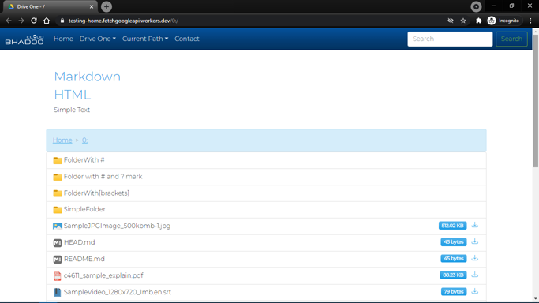</picture></td>
      <td><picture><source media="(min-width:820px)" srcset="images/themes/cosmo.png"><source media="(min-width:560px)" srcset="images/themes/cosmo-small.png">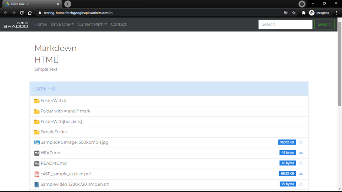</picture></td>
    </tr>
    <tr>
      <th>cyborg</th>
      <th>darkly</th>
    </tr>
    <tr>
      <td><picture><source media="(min-width:820px)" srcset="images/themes/cyborg.png"><source media="(min-width:560px)" srcset="images/themes/cyborg-small.png">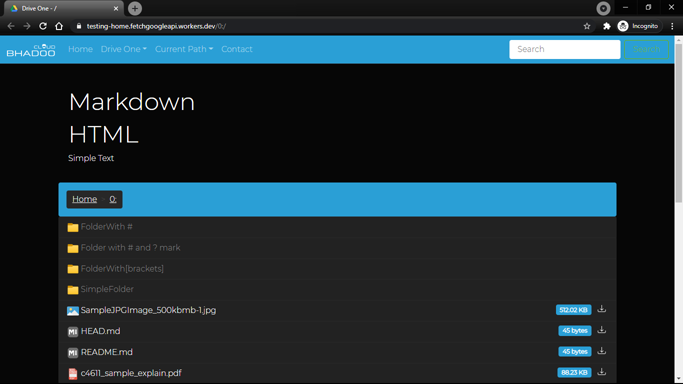</picture></td>
      <td><picture><source media="(min-width:820px)" srcset="images/themes/darkly.png"><source media="(min-width:560px)" srcset="images/themes/darkly-small.png">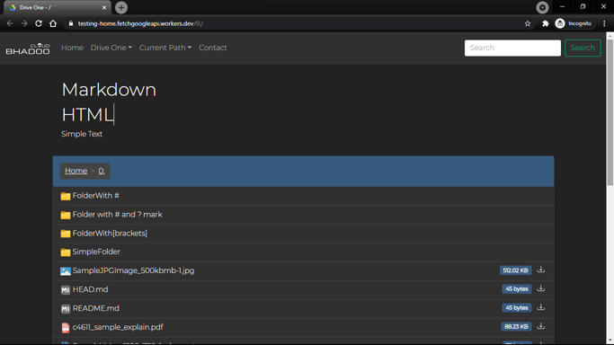</picture></td>
    </tr>
    <tr>
      <th>flatly</th>
      <th>journal</th>
    </tr>
    <tr>
      <td><picture><source media="(min-width:820px)" srcset="images/themes/flatly.png"><source media="(min-width:560px)" srcset="images/themes/flatly-small.png">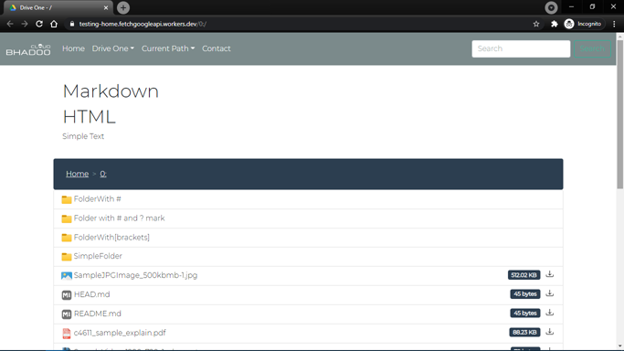</picture></td>
      <td><picture><source media="(min-width:820px)" srcset="images/themes/journal.png"><source media="(min-width:560px)" srcset="images/themes/journal-small.png">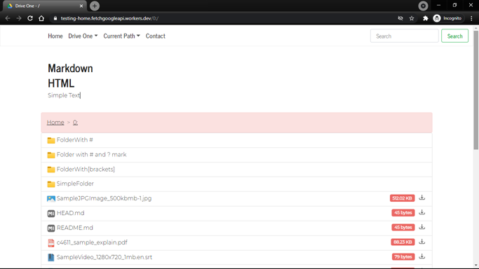</picture></td>
    </tr>
    <tr>
      <th>litera</th>
      <th>lumen</th>
    </tr>
    <tr>
      <td><picture><source media="(min-width:820px)" srcset="images/themes/litera.png"><source media="(min-width:560px)" srcset="images/themes/litera-small.png">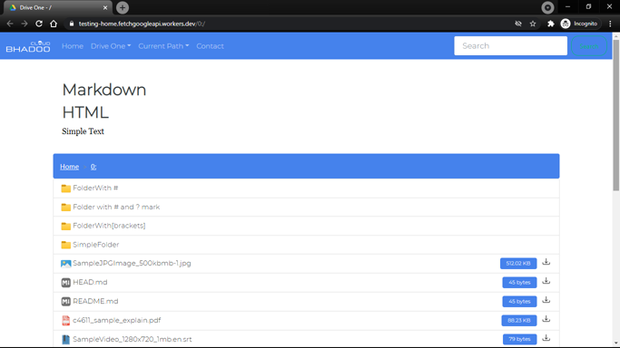</picture></td>
      <td><picture><source media="(min-width:820px)" srcset="images/themes/lumen.png"><source media="(min-width:560px)" srcset="images/themes/lumen-small.png"></picture></td>
    </tr>
    <tr>
      <th>lux</th>
      <th>materia</th>
    </tr>
    <tr>
      <td><picture><source media="(min-width:820px)" srcset="images/themes/lux.png"><source media="(min-width:560px)" srcset="images/themes/lux-small.png">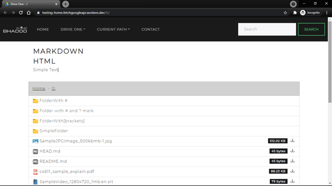</picture></td>
      <td><picture><source media="(min-width:820px)" srcset="images/themes/materia.png"><source media="(min-width:560px)" srcset="images/themes/materia-small.png">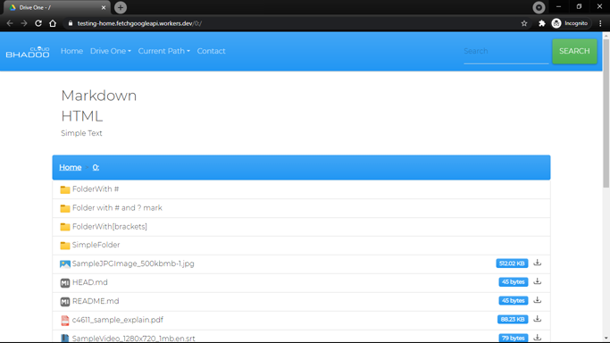</picture></td>
    </tr>
    <tr>
      <th>minty</th>
      <th>pulse</th>
    </tr>
    <tr>
      <td><picture><source media="(min-width:820px)" srcset="images/themes/minty.png"><source media="(min-width:560px)" srcset="images/themes/minty-small.png">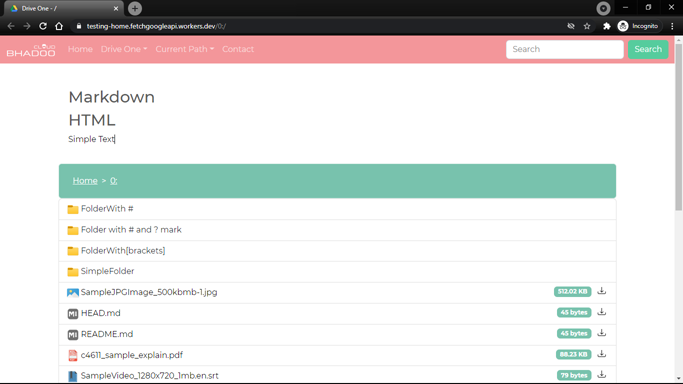</picture></td>
      <td><picture><source media="(min-width:820px)" srcset="images/themes/pulse.png"><source media="(min-width:560px)" srcset="images/themes/pulse-small.png">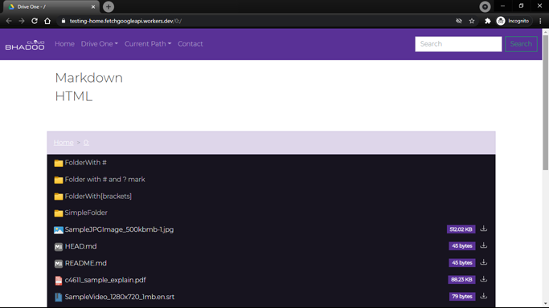</picture></td>
    </tr>
    <tr>
      <th>sandstone</th>
      <th>simplex</th>
    </tr>
    <tr>
      <td><picture><source media="(min-width:820px)" srcset="images/themes/sandstone.png"><source media="(min-width:560px)" srcset="images/themes/sandstone-small.png">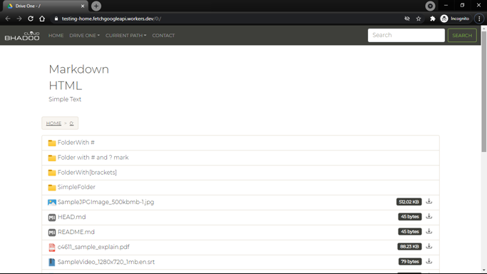</picture></td>
      <td><picture><source media="(min-width:820px)" srcset="images/themes/simplex.png"><source media="(min-width:560px)" srcset="images/themes/simplex-small.png"></picture></td>
    </tr>
    <tr>
      <th>sketchy</th>
      <th>slate</th>
    </tr>
    <tr>
      <td><picture><source media="(min-width:820px)" srcset="images/themes/sketchy.png"><source media="(min-width:560px)" srcset="images/themes/sketchy-small.png">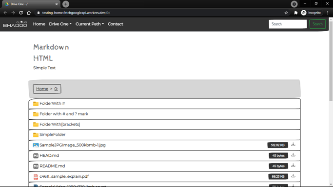</picture></td>
      <td><picture><source media="(min-width:820px)" srcset="images/themes/slate.png"><source media="(min-width:560px)" srcset="images/themes/slate-small.png">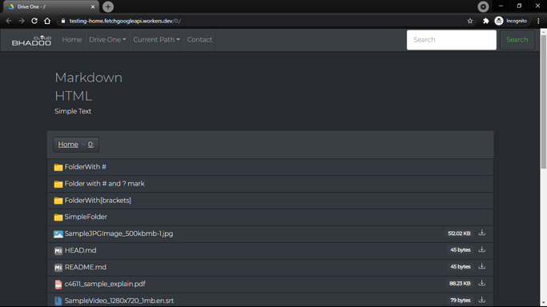</picture></td>
    </tr>
    <tr>
      <th>solar</th>
      <th>spacelab</th>
    </tr>
    <tr>
      <td><picture><source media="(min-width:820px)" srcset="images/themes/solar.png"><source media="(min-width:560px)" srcset="images/themes/solar-small.png">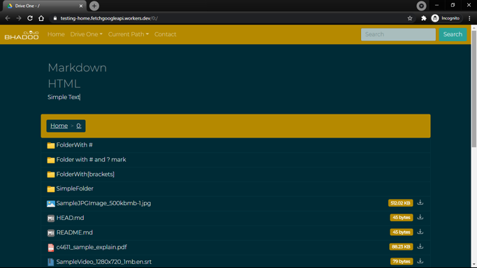</picture></td>
      <td><picture><source media="(min-width:820px)" srcset="images/themes/spacelab.png"><source media="(min-width:560px)" srcset="images/themes/spacelab-small.png">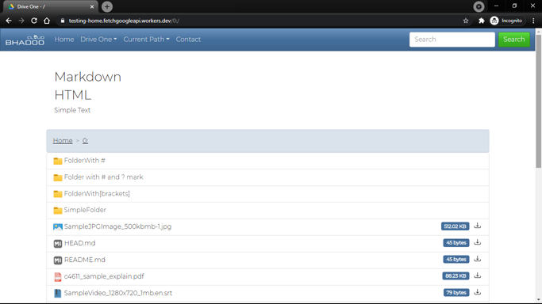</picture></td>
    </tr>
    <tr>
      <th>superhero</th>
      <th>united</th>
    </tr>
    <tr>
      <td><picture><source media="(min-width:820px)" srcset="images/themes/superhero.png"><source media="(min-width:560px)" srcset="images/themes/superhero-small.png">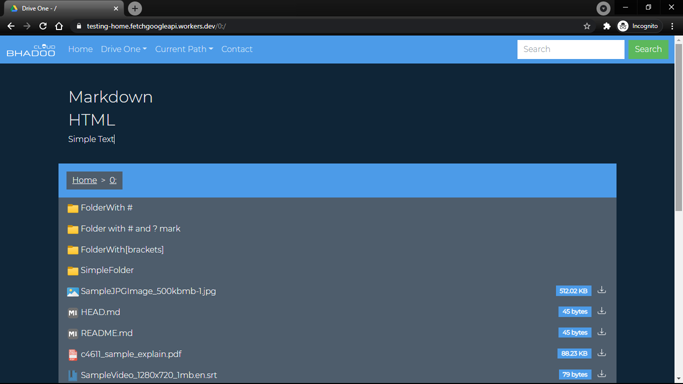</picture></td>
      <td><picture><source media="(min-width:820px)" srcset="images/themes/united.png"><source media="(min-width:560px)" srcset="images/themes/united-small.png">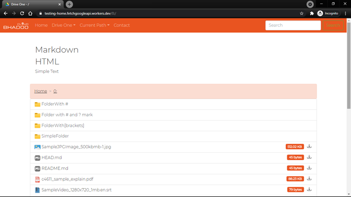</picture></td>
    </tr>
    <tr>
      <th>yeti</th>
      <th>vapor</th>
    </tr>
    <tr>
      <td><picture><source media="(min-width:820px)" srcset="images/themes/yeti.png"><source media="(min-width:560px)" srcset="images/themes/yeti-small.png">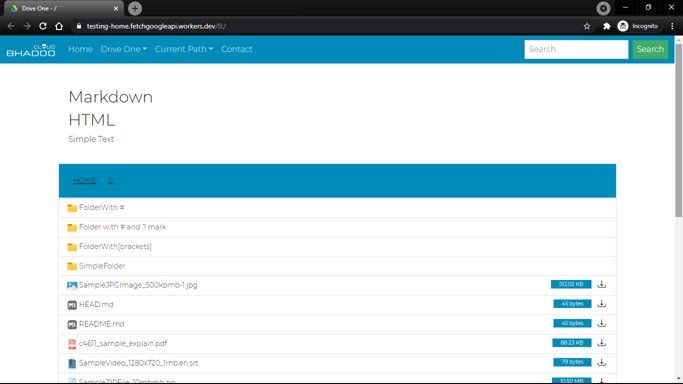</picture></td>
      <td><picture><source media="(min-width:820px)" srcset="images/themes/vapor.png"><source media="(min-width:560px)" srcset="images/themes/vapor-small.png">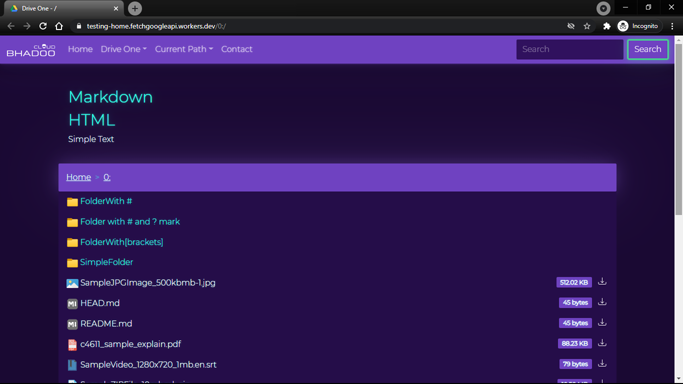</picture></td>
    </tr>
    <tr>
      <th>morph</th>
      <th>quartz</th>
    </tr>
    <tr>
      <td><picture><source media="(min-width:820px)" srcset="images/themes/morph.png"><source media="(min-width:560px)" srcset="images/themes/morph-small.png">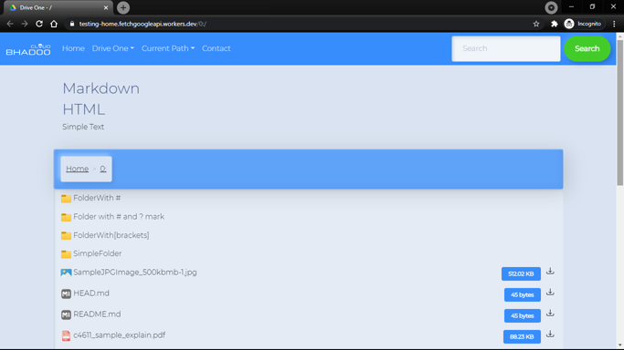</picture></td>
      <td><picture><source media="(min-width:820px)" srcset="images/themes/quartz.png"><source media="(min-width:560px)" srcset="images/themes/quartz-small.png">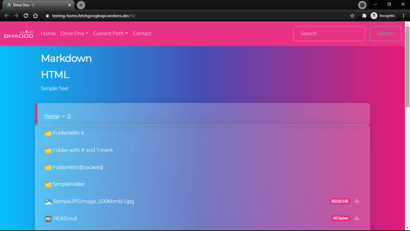</picture></td>
    </tr>
    <tr>
      <th>zephyr</th>
      <th></th>
    </tr>
    <tr>
      <td><picture><source media="(min-width:820px)" srcset="images/themes/zephyr.png"><source media="(min-width:560px)" srcset="images/themes/zephyr-small.png">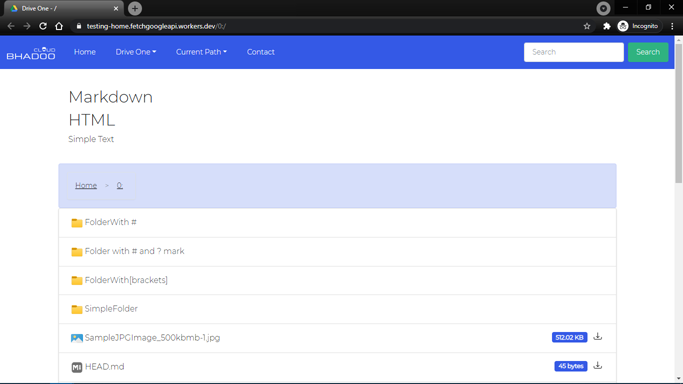</picture></td>
      <td></td>
    </tr>
  </table>
</details>


### Audio And Video Support

- Poster for Audio and Video are added as default.
- The Index fetches Posters from Google Drive media files, uses default if none available.
- If audio/video is streamable, then it is played by Plyr addin in the browser.

## Disclaimer

- This project is not associated with Google, this project uses Google Drive API to Index Files and Folders.
- These Index's are written by someone else, possibly by donva and [maple3142](https://github.com/maple3142/GDIndex).
- Beta Version is redesigned using Bootstrap from Alpha Version by [Parveen Bhadoo](https://twitter.com/ParveenBhadoo).
- The Original Repo was imported from [yanzai](https://github.com/yanzai/goindex) and then modified for personal use.

## Legal Disclaimer

- [Hash Hackers](https://gitlab.com/HashHackers) or Bhadoo Cloud or [Parveen Bhadoo](https://gitlab.com/ParveenBhadooOfficial) or [I](https://github.com/rokibhasansagar) do not own the websites created using this software. The Software is under MIT License and Free to use for everyone personally or commercially. If any site is found using the name in title as the project or related names, shouldn't be assumed to be associated with us. The Software provides full configuration to the user to update and change the names of title, contact information for the published website using this software.
- As an open-source Software, it can be used by good and bad actors both, eg. the use of [YT-DL](https://youtube-dl.org), read full post [here](https://github.blog/2020-11-16-standing-up-for-developers-youtube-dl-is-back/).

## Support the Original Project

[](https://www.buymeacoffee.com/bhadoo)

- Contribute to this project or improve this README.

## License

- [MIT License](https://github.com/rokibhasansagar/BhadooGDIndex/blob/master/LICENSE)

## Credits

- Base Source: [maple3142](https://github.com/maple3142/GDIndex) and [yanzai](https://github.com/yanzai/goindex)
- CSS: [Bootstrap](https://getbootstrap.com) and [Bootswatch](https://bootswatch.com)
- API: [Google Drive API](https://developers.google.com/drive/api)
- [jQuery](https://jquery.com)
- PDF Viewer: [pdf.js](https://github.com/mozilla/pdf.js)
- Audio and Video Player: [plyr.io](https://github.com/sampotts/plyr)
- CDN: [jsDelivr](https://www.jsdelivr.com)
- Minified JS: [Toptal](https://www.toptal.com/developers/javascript-minifier)
- Obfuscator: [JavaScript Obfuscator Tool](https://obfuscator.io)
- Hosting: [Gitlab](https://gitlab.com) and [npm](https://www.npmjs.com)
- Website Hosting: [js.org](https://js.org) and [GitHub](https://github.com)
- Dev Editor Used: [ATOM](https://atom.io)
- Made for: [Cloudflare Workers](https://workers.cloudflare.com)
- Several Different Fixes by [SpEcHiDe](https://github.com/SpEcHiDe), [Adnan Ahmad](https://gitlab.com/viperadnan), [Prashanth C A](https://github.com/Achrou/goindex-theme-acrou/pull/176), [cheems](https://github.com/cheems/goindex-extended/blob/master/index.js#L553), [iSumitBot](https://t.me/isumitbot) and Unmentioned Forgotten Contributors.

### Donate by Crpto to the Original Author

- ETH `0xaf25cdc7967213172a745453a64e8a0b59686729`
- BTC `3BgSznxLB5u4WiuVERb1dKWeTqSSwK9NPW`
- BAT `0xaf25cdc7967213172a745453a64e8a0b59686729`
